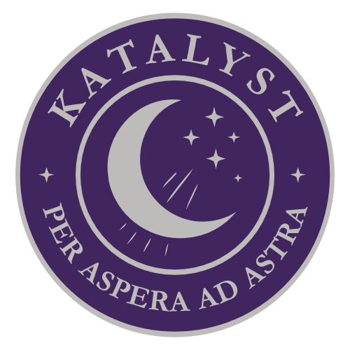

# CLAVIS

<strong>CLAVIS BY</strong>  
  

## Description

CLAVIS is a web application that allows users to change their passwords in Active Directory or Samba AD. Use StartTLS connection and allow self signed certificates (has disabled certificate validation).

## Background
I have a home lab with a Samba AD domain controller and I don't want to use terminal or windows tools to change manually the passwords of the users. So I decided to create a web application to change the passwords of the users.

## Features

- [x] Change password for users in Active Directory or Samba AD
- [x] Use StartTLS connection
- [x] Allow self signed certificates (has disabled certificate validation)

## Password Policy

- Minimum 8 characters
- At least one uppercase letter
- At least one lowercase letter
- At least one number
- At least one special character

# Environment Variables

| Variable | Description | Default |
|----------|-------------|---------|
| LDAP_URL | LDAP server URL | ldap://ldap.example.com |
| LDAP_BASE_DN | LDAP base DN | dc=example,dc=com |
| LDAP_SERVICE_USER | LDAP service user | cn=admin,dc=example,dc=com |
| LDAP_SERVICE_PASSWORD | LDAP service password | admin |
| RUST_LOG | Log level | info |
| BIND_ADDRESS | Bind address | 0.0.0.0:40000 |
